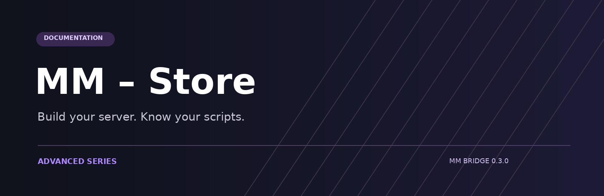

# MM – Store

**Your Advanced resources. One place to get them running.**

Installation, configuration, gameplay and integration guides for the Advanced series and MM Bridge. Documentation stays in English for customers; products retain their own DA/EN options where supplied.

## Start here

| I want to… | Open |
| --- | --- |
| Install my first script | [Quick start](getting-started/installation.md) |
| Check my server stack | [Compatibility](bridge/compatibility.md) |
| Choose a product | [Resource catalog](products/README.md) |
| Set up shared integrations | [MM Bridge](bridge/README.md) |
| Connect GitBook correctly | [Git Sync setup](getting-started/gitbook-import.md) |
| Resolve a problem | [Support](getting-started/support.md) |


Use mm_bridge 0.3.0+ and the product versions listed in the catalog. Provider support is feature-specific; see the compatibility table before installation.


## Build around your server

Use QBox, QBCore, ESX or a custom framework where the resource supports the required features. Configure inventory, target, phone and billing centrally, then keep each product's gameplay settings in its own config.

Start with one complete workflow on staging. Confirm old data loads, payment and item consumption happen once, and multiplayer roles behave correctly before adding more products.

[Explore the Advanced series →](products/README.md)
